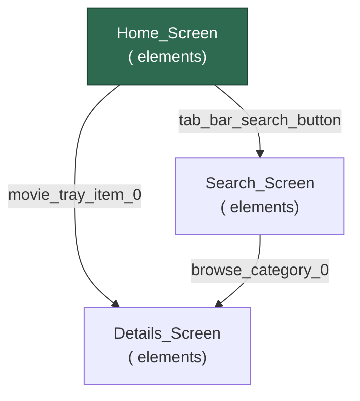

# Cartographer — Output Format Reference

Exact schemas and templates for each artifact Tadataka produces.

---

## 1. Element Catalog (`element_catalog.json`)

The primary deliverable. A flat, searchable inventory of every element across all discovered screens.

### Schema

```json
{
  "generated": "ISO8601 timestamp",
  "totalScreens": 8,
  "totalElements": 342,
  "withIdentifiers": 187,
  "interactive": 94,
  "screens": ["Home_Screen", "Search_Screen", ...],
  "elements": [
    {
      "screen": "Home_Screen",
      "platform": "ios",
      "type": "button",
      "id": "tab_bar_home_button",
      "label": "Home",
      "role": "tab",
      "enabled": true,
      "hittable": true,
      "hasId": true
    }
  ],
  "idsByScreen": {
    "Home_Screen": ["tab_bar_home_button", "tray_collection_view", ...]
  },
  "idsByType": {
    "button": ["tab_bar_home_button", "context_menu_button", ...],
    "cell": ["pill_cell_1", "browse_item_0", ...]
  }
}
```

### Element roles

When classifying elements from agent-device snapshots, use these roles:

| Role | Meaning | agent-device element types |
|---|---|---|
| `nav` | Navigation trigger — tapping likely changes screen | button, cell, link that are hittable |
| `tab` | Tab bar item — top-level navigation | button inside tab-bar container |
| `back` | Back/close/dismiss button | button with back/close/dismiss/done in id or label |
| `input` | Text input field | text-field, secure-text-field, search-field |
| `toggle` | State toggle — changes state, not screen | switch, segmented-control, slider |
| `scroll` | Scrollable container | collection-view, table, scroll-view |
| `content` | Static/informational | static-text, image, other non-interactive |
| `dangerous` | Must never tap | matches blocked identifier or label patterns |

### Building the catalog from agent-device snapshot

When parsing `agent-device snapshot --json` output, map fields as follows:

| Catalog field | agent-device snapshot field |
|---|---|
| `platform` | `--platform` flag used to open the session (`ios` \| `android`) |
| `type` | Node type (e.g., `button`, `other`, `cell`) |
| `id` | `identifier` property (may be empty) |
| `label` | `label` property or node display text |
| `enabled` | Infer from interactivity (present in `-i` output = enabled) |
| `hittable` | Present in `-i` snapshot with a ref = hittable |
| `hasId` | `id` is non-empty |

Assign roles in this priority order:
1. `dangerous` — id or label matches any blocked pattern
2. `back`      — button with back/close/dismiss/done in id or label
3. `tab`       — button whose parent container is a tab-bar
4. `input`     — type is text-field, secure-text-field, or search-field
5. `toggle`    — type is switch, segmented-control, or slider
6. `scroll`    — type is collection-view, table, or scroll-view
7. `nav`       — button/cell/link that is hittable (default for interactive elements)
8. `content`   — everything else (static-text, image, non-interactive)

---

## 2. Navigation Map (`navigation_map.mermaid`)

Visual diagram of screen-to-screen navigation. Paste into GitHub, Confluence, or any Mermaid renderer.

### Template



### Rules

- Node IDs must be Mermaid-safe: replace spaces, hyphens, dots, slashes with underscores
- Node labels include screen name and element count
- Edge labels show the trigger element's identifier (preferred) or label (fallback, truncated to 30 chars)
- Style the starting screen with a distinct color
- Keep edge labels short — they're for quick identification, not full descriptions

---

## 3. Exploration Summary (`exploration_summary.txt`)

Human-readable report of what was found.

### Template

```
==================================================================
  Cartographer — Exploration Summary
==================================================================

Generated: <ISO8601 timestamp>
Duration:  <N>s

📊 Statistics
   Screens discovered:      <N>
   Elements catalogued:      <N>
   With identifiers:         <N> (<percent>%)
   Interactive elements:     <N>
   Navigation edges:         <N>
   Dangerous elements skipped: <N>

📱 Screen Breakdown
------------------------------------------------------------------

  📍 <Screen_Name>
     Total elements:       <N>
     Interactive elements:  <N>
     With identifiers:     <N>
     Key identifiers (top 5; prioritize tab and nav roles):
       • [button] tab_bar_home_button
       • [cell] playback_movie_tray_item_0
       • [collectionView] tray_list_collection_view

🔗 Navigation Edges
------------------------------------------------------------------
  Home_Screen → Search_Screen
    via [button] tab_bar_search_button

  Home_Screen → Details_Screen
    via [cell] movie_tray_item_0

⚠️ Elements Without Identifiers
------------------------------------------------------------------
  Home_Screen: 45 elements missing identifiers
  Search_Screen: 12 elements missing identifiers

⛔ Dangerous Elements Skipped
------------------------------------------------------------------
  • log_out_button / Log Out (on Profile_Screen)
  • subscribe_button / Upgrade Plan (on Profile_Screen)

==================================================================
```

---

## File Naming and Location

Save all artifacts to a timestamped directory:

```
/tmp/Cartographer/<ISO8601-timestamp>/
├── element_catalog.json
├── navigation_map.mermaid
└── exploration_summary.txt
```

> `/tmp` is cleared on reboot. For artifacts you want to keep, use `~/Desktop/Cartographer/`
> or a path relative to your project. `/tmp` is fine for quick inspection runs.

For Mode 1 (snapshot) and Mode 2 (navigate+snapshot), the element catalog alone is
usually sufficient. Only generate all three for Mode 3 (explore).
